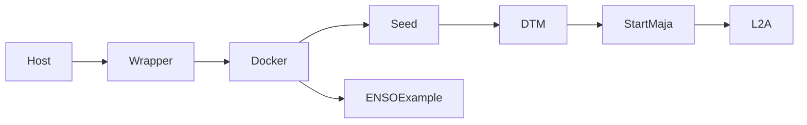
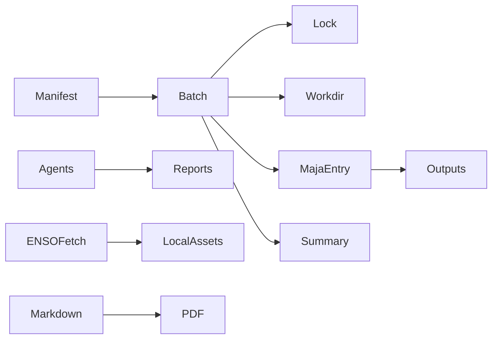

# PLAN — Audit et mise en œuvre WP_02 MAJA ENSO

## Structure du dépôt
Dépôt plat Docker-first: scripts Bash racine, `Dockerfile`, `folder.txt`, modules Python `scripts/`, toolkit `tools/agents/`, tests `tests/`, exemples `examples/`, rapports `docs/reports`, exigences `docs/requirements`, livrables `deliverables`.

## Architecture MAJA existante
MAJA 4.10.0 est installé dans l'image Docker sous `/opt/maja-precompiled`; les données sont montées sous `/data/MAJA-metadata`; le workspace est `/opt/maja-workspace`.

## Entrées et flux existants
| Component | Current entry point | Inputs | Outputs | Risks | Planned change |
|---|---|---|---|---|---|
| Setup hôte | `maja_setup.sh` | Docker, host dirs | arborescence `/data` | droits/stockage | documenter seulement |
| Container | `run_maja_wrapper.sh` | image/volumes | shell conteneur | image absente | préserver |
| Seed SAFE | `0_seed_example_safe.sh` | SAFE embarqué | S2-L1C | gros fichier non commité | préserver |
| ENSO exemple | `1_enso_download_example.sh` | URL ROB1E | `/data/.../ENSO` | réseau/licence | outil host additif |
| DTM | `2_dtmcreation_example.sh` | DEM/GSW/L1C | DTM | cache partagé | batch isolé |
| MAJA L2A | `3_startmaja_example.sh` | `folder.txt`, L1C, DTM | S2-L2A | séquentiel | runner invoque commandes |
| Config | `folder.txt` | chemins MAJA | paramètres | chemins fixes | préserver |

## `folder.txt`
`folder.txt` contient `[Maja_Inputs]` avec `repWork`, `repGipp`, `repMNT`, `repL1`, `repL2`, `exeMaja`, `repCAMS` et `[DTM_Creation]` avec DEM/GSW.

## Docker et VM
Dockerfile Ubuntu 20.04, utilisateur `maja`, volumes `/data/MAJA-metadata/*`. VM supposée Linux avec Docker, CPU/RAM/disque suffisants et accès réseau/auxiliaires.

## Répertoires
| Type | Path |
|---|---|
| Input L1 | `/data/MAJA-metadata/S2-L1C` |
| Output L2 | `/data/MAJA-metadata/S2-L2A` |
| CAMS | `/data/MAJA-metadata/CAMS` |
| DTM | `/data/MAJA-metadata/DTM` |
| Temp | `/data/MAJA-metadata/tmp`, `/opt/maja-tmp` |
| Batch local | `outputs/batch`, `.work/maja-batch`, `logs/maja-batch` |

## Dépendances externes
Docker, MAJA binaries, StartMaja, CAMS/ECMWF credentials or cache, DEM/GSW, network for ENSO.

## Tests/CI/documentation existants
Tests Python partiels présents; CI GitHub Actions présent. Documentation initiale README/TECHNICAL_GUIDE/README_EXAMPLES.

## Risques concurrence
`repWork`, caches CAMS/DTM, sorties L2, logs et configuration partagés. Mitigation: workdir, log, lock et output par job; rejet des conflits.

## Risques scientifiques
Capteur ENSO, radiométrie, métadonnées d'angles, calibration, validation nuages/ombres et critères d'acceptation inconnus.

## Diagramme état courant

## Diagramme cible

## Fichiers à ajouter/modifier
Ajouts: exigences, rapports, build PDF, manifestes exemples, tests, CI, assets ENSO. Modifications: README, batch runner, ENSO fetcher, agent toolkit si nécessaire.

## Stratégie validation
`python -m py_compile`, `pytest -q`, `python tools/agents/agentctl.py all`, `python scripts/maja_batch.py --manifest examples/maja_batch_manifest.yaml --dry-run`, intégration factice, `python scripts/build_reports.py`, Docker si archives requises disponibles.

## Rollback
Tous les changements sont additifs sauf améliorations de scripts Python existants. Retour possible par suppression des nouveaux répertoires/fichiers et restauration de `README.md`/scripts Python depuis Git.

## Questions non résolues
Format ENSO, licence images, accès CAMS/ECMWF, seuils scientifiques, ressources VM, disponibilité des archives Docker MAJA/SAFE.
