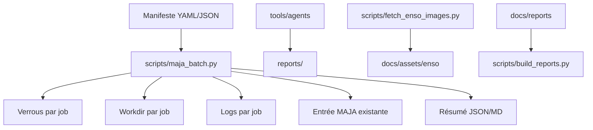

# WP_02 — Analyse des besoins et étude de faisabilité

Version 1.0 — Généré le 2026-06-24.

## 1. Page de garde
Projet MAJA ENSO Expleo. Livrable éditable en Markdown, PDF généré dans `deliverables/`.

## 2. Métadonnées documentaires
| Champ | Valeur |
|---|---|
| Dépôt | Maja_expleo |
| Workflow observé | Docker MAJA 4.10.0, version image 1.0.0 |
| Entrée démonstration | `3_startmaja_example.sh` avec `startmaja -f folder.txt -t T31TCJ -s Toulouse -d 2025-11-22 -e 2025-11-23` |
| Statut scientifique | Compatibilité ENSO non prouvée sans métadonnées et données de référence |

## 3. Historique des versions
| Version | Date | Description |
|---|---|---|
| 1.0 | 2026-06-24 | Audit, exigences, faisabilité, matrices et plan de validation |

## 4. Résumé exécutif
Le dépôt fournit un environnement Docker de démonstration MAJA avec scripts de seed SAFE, téléchargement ENSO illustratif, génération DTM et lancement L2A. Les ajouts livrent un runner batch sûr, un toolkit agents, un outil de récupération ENSO, des exigences WP_02, une traçabilité, une préparation de validation et des PDF. La faisabilité technique d'un prototype est positive sous réserve de disposer des binaires/données MAJA. La faisabilité scientifique ENSO reste conditionnée par la documentation des formats, métadonnées, angles et critères de validation.

## 5. Contexte projet
MAJA est utilisé ici comme brique de correction atmosphérique Sentinel-2 L2A. ENSO est traité comme source documentaire et cible potentielle d'analyse, mais le dépôt ne contient pas de spécification complète de produit ENSO exploitable scientifiquement.

## 6. Périmètre
Inclus: audit dépôt, exigences WP_02, parallélisation sûre, tests, CI, documentation, PDF. Exclus: validation scientifique finale, adaptation algorithmique MAJA noyau, fourniture credentials CAMS/ECMWF.

## 7. Méthodologie
Inspection des fichiers, exécution des tests disponibles, création de tests factices, distinction entre faits du dépôt, hypothèses d'ingénierie et validations scientifiques requises.

## 8. Sources et preuves
| Preuve | Utilisation |
|---|---|
| `Dockerfile` | Architecture image, MAJA 4.10.0, volumes, dépendances |
| `folder.txt` | Répertoires de travail, GIPP, DTM, L1, L2, CAMS |
| `3_startmaja_example.sh` | Commande réelle de lancement MAJA |
| `run_maja_wrapper.sh` | Flux hôte Docker |
| Tests ajoutés | Validation logicielle sans données MAJA |

## 9. Workflow MAJA existant
```mermaid
flowchart TD
Host[Hôte] --> Wrapper[run_maja_wrapper.sh]
Wrapper --> Container[Conteneur maja-run]
Container --> Seed[0_seed_example_safe.sh]
Container --> ENSO[1_enso_download_example.sh]
Container --> DTM[2_dtmcreation_example.sh]
DTM --> Start[3_startmaja_example.sh]
Start --> L2A[/data/MAJA-metadata/S2-L2A]
```

## 10. Workflow cible


## 11. Analyse des besoins métier
### Besoins confirmés
- Préserver le workflow Docker et les scripts MAJA existants.
- Produire les livrables WP_02 en français.
- Disposer d'exécution batch, logs, reprise, traçabilité.

### Besoins inférés
- Traitement reproductible de plusieurs scènes.
- Diagnostic d'échec et collecte métriques.
- Fonctionnement local, Docker et VM.

### Hypothèses
- ENSO nécessite une intégration produit ou conversion compatible MAJA.
- Les auxiliaires CAMS/ECMWF restent nécessaires pour traitement atmosphérique.

### Questions ouvertes
- Format exact produit ENSO, bandes, calibration, angles, masque nuage, MNT requis.
- Volumétrie, latence et critères qualité cibles.

### Hors périmètre
- Approbation scientifique finale et modification du cœur MAJA.

## 12. Analyse des cas d'usage
| ID | Titre | Objectif | Acteurs | Préconditions | Entrées | Flux principal | Alternatives | Sorties | Échecs | Performance | Critère | Scripts | Exigences | Questions |
|---|---|---|---|---|---|---|---|---|---|---|---|---|---|---|
| UC-01 | Traiter un produit ENSO | Lancer MAJA sur un produit | Opérateur | Produit compatible | L1/metadata | Manifest job unique | wrapper existant | L2A/log | format invalide | à mesurer | sortie complète | maja_batch | FUN-001 | compatibilité |
| UC-02 | Traiter plusieurs produits | Paralléliser sans collision | Opérateur | jobs distincts | manifest | ProcessPool | fail-fast option | résumés | lock/output conflit | débit mesuré | pas de conflit | maja_batch | FUN-002 | workers max |
| UC-03 | Angles variables | Évaluer impact géométrie | Scientifique | métadonnées angles | angles | revue + test | simulation | décision | angle inconnu | non défini | protocole validé | rapports | SCI-001 | représentation |
| UC-04 | Reprocess config | Comparer configurations | Ingénieur | configs versionnées | config | changement empreinte | force | nouveaux outputs | cache incohérent | à mesurer | empreinte change | maja_batch | PERF-001 | GIPP |
| UC-05 | Reprise interrompue | Éviter doublons | Exploitant | metadata succès | summary | --resume | --force | skipped/success | metadata invalide | reprise courte | skip sûr | maja_batch | FUN-002 | verrou actif |
| UC-06 | Diagnostiquer échec | Conserver preuves | Support | logs | stderr/stdout | agent debug | manuel | finding | log absent | immédiat | erreur visible | agentctl | DOC-001 | rétention |
| UC-07 | Comparer configs | Répéter mesures | Scientifique | critères | GIPP | jobs séparés | baseline | tableaux | non comparable | à définir | rapport | batch/reports | VAL-001 | métriques |
| UC-08 | Exécution locale | Tester hors Docker | Dev | Python | manifest | pytest | dry-run | rapports | MAJA absent | léger | tests passent | pytest | OPS-001 | dépendances |
| UC-09 | Docker | Reproduire environnement | DevOps | Docker | image | build/run | compose absent | conteneur | données absentes | overhead | commandes doc | Dockerfile | OPS-001 | stockage |
| UC-10 | VM | Déployer hôte | Exploitant | Linux/Docker | volumes | setup | manuel | environnement | droits | à définir | checklist | README | OPS-001 | sizing |
| UC-11 | Logs métriques | Observer | Support | jobs | logs | agents | parse | report | logs vides | rapide | JSON/MD | agentctl | PERF-001 | monitoring |
| UC-12 | Complétude sorties | Valider | QA | required_outputs | output | resume check | custom | status | marker seul | rapide | requis présents | batch | FUN-002 | liste sorties |
| UC-13 | Cohérence scientifique | Valider réflectance | Scientifique | vérité terrain | L2A | protocole | expert | décision | pas référence | à définir | seuils | docs | SCI-001 | dataset |
| UC-14 | Images ENSO doc | Localiser assets | Rédacteur | réseau | URL | fetch | dry-run | manifest | licence inconnue | limité | fichiers locaux | fetch | DATA-001 | licence |
| UC-15 | Générer rapports | Livrer PDF | PM | sources | MD | build_reports | CI | PDF | moteur absent | rapide | non vide | build_reports | VAL-001 | signature |

## 13. Performances attendues
| Indicateur | Statut cible | Protocole benchmark |
|---|---|---|
| Durée par produit | Proposed for validation | exécuter N produits réels, mesurer `duration_s` |
| Débit batch | Proposed for validation | varier workers 1,2,4,8 |
| CPU/RAM/disque | Proposed for validation | `agentctl profile`, `docker stats` |
| Taux échec | Proposed for validation | campagne représentative |
| Reprise | Measured during this mission (logiciel factice) | exécuter puis `--resume` |
| Cohérence scientifique | Not defined | définir seuils avec expert |

## 14. Faisabilité scientifique
| Domaine | Classification | Analyse |
|---|---|---|
| Compatibilité capteur | Unknown | Dépôt centré Sentinel-2; ENSO non spécifié. |
| Métadonnées radiométriques | Requires client confirmation | calibration/gains nécessaires. |
| Angles solaires/vue | Requires remote-sensing validation | représentation non déduite du dépôt. |
| CAMS/atmosphère | Confirmed by repository evidence | `folder.txt` contient `repCAMS`. |
| Nuages/ombres | Scientific hypothesis | MAJA traite Sentinel-2, pas preuve ENSO. |
| Validation | Requires client confirmation | scènes référence et métriques absentes. |

## 15. Faisabilité technique
| Area | Current state | Evidence | Feasibility | Risk | Required adaptation | Complexity | Validation |
|---|---|---|---|---|---|---|---|
| Architecture | Scripts Docker plats | Dockerfile | Feasible with limited development | chemins fixes | ajout batch additif | Low | tests |
| Entrée MAJA | `startmaja` | script 3 | Feasible without modification | MAJA absent local | préserver script | Low | dry-run |
| Batch | absent/partiel | audit initial | Feasible with limited development | collisions | verrous/workdir | Medium | pytest |
| Docker | image lourde | Dockerfile | Requires infrastructure | fichiers zip absents | doc blocage | Medium | build si assets |
| CI | workflow existant | `.github` | Feasible with limited development | shellcheck absent | CI tolérant | Low | pytest |
| ENSO | script wget | `1_enso...` | Requires client input | licence/format | fetch manifest | Low | dry-run/download |

## 16. Contraintes opérationnelles et risques
| Risk ID | Risk | Probability | Impact | Criticality | Mitigation | Owner |
|---|---|---|---|---|---|---|
| R-001 | Données MAJA/SAFE non disponibles | Medium | High | High | volumes et prérequis documentés | Exploitation |
| R-002 | Credentials CAMS/ECMWF absents | Medium | High | High | procédure d'accès | Client/DevOps |
| R-003 | Angles ENSO inconnus | High | High | Critical | atelier scientifique | Scientifique |
| R-004 | Stockage temporaire insuffisant | Medium | Medium | Medium | sizing benchmark | DevOps |
| R-005 | Licence images ENSO non vérifiée | Medium | Medium | Medium | avertissement attribution | PM |

## 17. Limitations MAJA identifiées
| Limitation | Preuve | Impact | Statut |
|---|---|---|---|
| Workflow démonstration séquentiel | scripts 0-3 | pas de batch natif | corrigé partiellement |
| Chemins `/data/MAJA-metadata` fixes | Dockerfile/folder.txt | contraintes Docker/VM | restant |
| Validation ENSO absente | dépôt | blocage scientifique | restant |
| Cache partagé potentiel | `repCAMS`, `repMNT`, `repWork` | risque concurrence | atténué par workdir job |
| Tests historiques limités | tests initiaux | maturité CI | corrigé partiellement |

## 18. Analyse des angles variables
| Impact area | Current MAJA assumption | ENSO characteristic | Gap | Consequence | Required validation |
|---|---|---|---|---|---|
| Métadonnées angle | non déterminé dans dépôt | inconnue | majeur | parsing impossible | spécification ENSO |
| Bande/détecteur | Sentinel-2 probable | inconnue | majeur | biais réflectance | expert télédétection |
| Grille/pixel | inconnu | inconnue | critique | correction atmosphérique incertaine | tests référence |
| Nuages/ombres | algorithmes MAJA | non prouvé | moyen | faux masques | comparaison visuelle/quantitative |
| Temps/mémoire | non mesuré réel | dépend produit | moyen | sizing incertain | benchmark |

## 19. Adaptations requises
| Adaptation ID | Description | Justification | Priority | Complexity | Dependencies | Risk | Validation |
|---|---|---|---|---|---|---|---|
| AD-001 | Obtenir spécification ENSO angles/radiométrie | valider SCI-001 | P0 | Medium | Client | critique | revue scientifique |
| AD-002 | Définir mapping produit ENSO vers entrée MAJA | traitement réel | P1 | High | AD-001 | élevé | prototype |
| AD-003 | Batch sûr | production | P1 | Medium | aucun | moyen | tests |
| AD-004 | Protocole benchmark | performances | P2 | Low | données | moyen | campagne |
| AD-005 | Observabilité | exploitation | P2 | Low | logs | faible | agent reports |

## 20. Catalogue exigences
Voir `docs/requirements/WP_02_requirements.md`.

## 21. Traçabilité
Voir `docs/requirements/WP_02_traceability_matrix.md`.

## 22. Conclusions de faisabilité
Technique: prototype faisable avec développements limités autour de l'existant. Opérationnel: faisable si Docker, volumes et accès auxiliaires sont maîtrisés. Scientifique: non concluant sans preuves ENSO; nécessite validation dédiée.

## 23. Recommandations
Prioriser AD-001/AD-002, exécuter benchmark sur 3 à 10 scènes réelles, figer les sorties attendues, valider les angles.

## 24. Plan de validation
Tests unitaires, dry-run batch, intégration factice, génération PDF, puis campagne réelle MAJA hors CI.

## 25. Questions ouvertes et informations manquantes
Format ENSO, licence images, accès CAMS/ECMWF, volumétrie, seuils qualité, ressources VM.

## 26. Glossaire
MAJA: MACCS ATCOR Joint Algorithm. ENSO: source/projet client à préciser. GIPP: paramètres processeur. DTM: modèle numérique terrain.

## 27. Références
Dépôt local Maja_expleo, scripts Docker et MAJA, documentation MAJA à fournir par le client pour validation finale.
